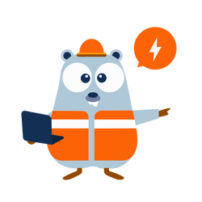

# Foreman

</img>

What is Foreman?  A library that helps you build an event driven application by handling all the complexity of decoding, routing, dispatching and executing commands or subscribing for events. By having Publish/Subscribe and MessageBus patterns you could build different components on top for various architecture approaches like orchestrated sagas or workflows.

## Pub/Sub features:

- configurable pool of workers for concurrent processing, high throughput
- graceful shutdown
- dynamic encoding/decoding of data structs
- message dispatcher
- transport interface: AMQP implementation

[Architecture breakdown](docs/Architecture%20breakdown.md)

[Getting started](docs/Getting%20started.md)

[Saga Component](docs/Saga%20component.md)

## Orchestrated sagas:

- workflow as code
- compensate & recover triggers
- saga store: mysql/pg
- history of events
- embed sagas as subtasks of parent saga
- HTTP API dashboard

## Roadmap:

1. Apache Kafka transport
2. protobuf message encoder

## License:

The MIT License (MIT). Please see [LICENSE](https://github.com/go-foreman/foreman/blob/master/LICENCE) for more information.
