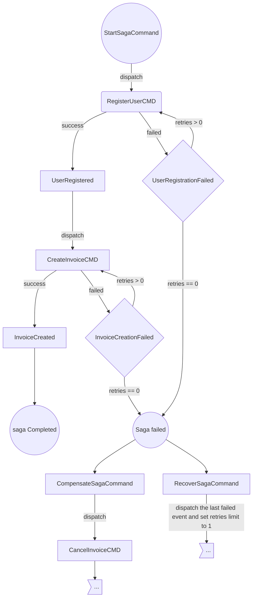

# Saga component

There are two existing types of sagas: `choreography` and `orchestration` based. A choreography-based saga requires no additional modules and can be implemented using just pub/sub. An orchestration-based one requires an orchestrator, this is the job of this component.

You can learn more about Saga pattern [here](https://microservices.io/patterns/data/saga.html). Also, very good explanation can be found in the book *"Microservices patterns"* by *Chris Richardson*.

In general an orchestrated saga is basically an asynchronous event dispatcher that works on top of a messaging system to guarantee message delivery between multiple services.

## Moving parts of the orchestrated saga component:

- System commands and saga handler - controls saga execution
- Saga store - used to store saga data, its state and events history
- Mutex - used to lock a saga instance in order to avoid race conditions
- http API server - get state of a saga instance

The main advantage over other solutions is an ability to define a saga as code thus one becomes a BPMN diagram described in code. Whole lot of flexibility for any kind of scenarios is present: a user can define own retry, recover and compensate mechanisms.

## Getting started

```go
sagaComponent := component.NewSagaComponent(
   func(scheme message.Marshaller) (saga.Store, error) {
      return saga.NewSQLSagaStore(db, saga.MYSQLDriver, scheme)
   },
   mutex.NewSqlMutex(db, saga.MYSQLDriver),
   component.WithSagaApiServer(httpMux),
)

sagaComponent.RegisterSagaEndpoints(listOfEndpoints...)
sagaComponent.RegisterSagas(listOfSagasTypes...)
sagaComponent.RegisterContracts(listOfContracts...)

// this option can be passed into NewMessageBus constructor
foreman.WithComponents(sagaComponent)
```

A saga type must follow `Saga` interface.

```go
type Saga interface {
	// as any message type in MessageBus a saga should have metadata
	message.Object
	// Init function assigns a contract type to a handler
	Init()
	// Start will be triggered when StartSagaCommand received
	Start(sagaCtx SagaContext) error
	// Compensate will be triggered when CompensateSagaCommand received
	Compensate(sagaCtx SagaContext) error
	// Recover will be triggered when RecoverSagaCommand received
	Recover(sagaCtx SagaContext) error
	// EventHandlers returns a list of assigned executors per type in Init()
	EventHandlers() map[scheme.GroupKind]Executor
	// SetSchema allows to set schema instance during the saga runtime
	SetSchema(scheme scheme.KnownTypesRegistry)
}
```

System contracts that control a saga: start, recover and compensate.

```go
// StartSagaCommand once received will create SagaInstance, save it to Store and Start()
type StartSagaCommand struct {
   message.ObjectMeta
   SagaUID   string         `json:"saga_uid"`
   ParentUID string         `json:"parent_uid"`
   Saga      message.Object `json:"saga"` 
}

type RecoverSagaCommand struct {
   message.ObjectMeta
   SagaUID string `json:"saga_uid"`
}

type CompensateSagaCommand struct {
   message.ObjectMeta
   SagaUID string `json:"saga_uid"`
}
```

Each saga message has `sagaUID` header set by orchestrator, it tells to which saga the message belongs to.
It’s important to return this header when replying with an event in command handler.
Otherwise the orchestrator won’t know which saga to process.

### Example

Here is an example of a process that registers a user and creates an invoice in a payment system.

Each of the above steps can have two states: successful and failed. In case of failure it’s suggested to retry the command again a few times. Mark saga as failed once retries limit is zero.

Depending on the business logic a recover or a compensation processes can be triggered either automatically or manually by the user.  Compensation mechanism in the current process should cancel the created invoice.

It’s important to know that after each handler is executed the saga is persisted into the store, so any changes to its state in handler result in an update.



```go
type SubscribeSaga struct {
   saga.BaseSaga //embeds ObjectMeta, EventHandlers() and SetSchema()  

	// business data
   Email        string  `json:"email"`
   Currency     string  `json:"currency"`
   Amount       float32 `json:"amount"`
   RetriesLimit int     `json:"retries_limit"`
}

// Init function assigns a contract type to a handler
func (r *SubscribeSaga) Init() {
	r.
		// handle user registration
		AddEventHandler(&contracts.UserRegistered{}, r.UserRegistered).
		AddEventHandler(&contracts.RegistrationFailed{}, r.RegistrationFailed).
		// handle invoice creation
		AddEventHandler(&contracts.InvoiceCreated{}, r.InvoiceCreated).
		AddEventHandler(&contracts.InvoiceCreationFailed{}, r.InvoiceCreationFailed)
		// in case of compensation handle invoice canllecation
		AddEventHandler(&contracts.InvoiceCanceled{}, r.CanceledInvoice).
		AddEventHandler(&contracts.InvoiceCancellationFailed{}, r.InvoiceCancellationFailed)
}

// Start will be triggered when StartSagaCommand received
func (r *SubscribeSaga) Start(execCtx saga.SagaContext) error {
	// dispatch the first command
	execCtx.Dispatch(&contracts.RegisterUserCmd{
		Email: r.Email,
	})
	return nil
}

// Compensate will be triggered when CompensateSagaCommand received
func (r *SubscribeSaga) Compensate(execCtx saga.SagaContext) error {
	// business logic allows to save unfinished registration of a user, just a failed invoice should be cancled if such exists. 
	execCtx.Dispatch(&contracts.CancelInvoiceCmd{
		InvoiceID: r.InvoiceID,
	})
	return nil
}
// Recover will be triggered when RecoverSagaCommand received
func (r *SubscribeSaga) Recover(execCtx saga.SagaContext) error {
	r.RetriesLimit = 1

	// let's push again last failed message with a single retry
	if ev := execCtx.SagaInstance().Status().FailedOnEvent(); ev != nil {
		execCtx.Dispatch(ev)
	}

	return nil
}

//here go business handlers for contracts

func (r *SubscribeSaga) UserRegistered(sagaCtx saga.SagaContext) error {
	//the user was registered, lets trigger the next command
	execCtx.Dispatch(&contracts.CreateInvoiceCmd{
		Email:    r.Email,
		Amount:   r.Amount,
		Currency: r.Currency,
	})

	return nil
}

func (r *SubscribeSaga) RegistrationFailed(sagaCtx saga.SagaContext) error {
	ev, _ := execCtx.Message().Payload().(*contracts.UserRegistered)
	//log the failure reason
	execCtx.LogMessage(log.ErrorLevel, ev.Reason)

	// custom retry logic
	if r.RetriesLimit > 0 {
		r.RetriesLimit--
		execCtx.Dispatch(&contracts.RegisterUserCmd{
			Email: r.Email,
		}, endpoint.WithDelay(time.Second * 5)) //do not retry immidiately, wait 5s

		return nil
	}

	// all retries are used, registration failed, need to mark this saga as failed one, the last failed message will be persisted into saga's state
	execCtx.SagaInstance().Fail(execCtx.Message().Payload())

	return nil
}

func (r *SubscribeSaga) InvoiceCreated(sagaCtx saga.SagaContext) error {
	// all steps are processed successfully, mark this saga as completed. 
	execCtx.SagaInstance().Complete()

	return nil
}

func (r *SubscribeSaga) InvoiceCreationFailed(sagaCtx saga.SagaContext) error {
	if r.RetriesLimit > 0 {
		r.RetriesLimit--

		execCtx.Dispatch(&contracts.CreateInvoiceCmd{
			Email:    r.Email,
			Amount:   r.Amount,
			Currency: r.Currency,
		})

		return nil
	}

	execCtx.SagaInstance().Fail(execCtx.Message().Payload())

	// Depending on business logic compansating or recover commands can be
  // pushed on user action or automatically.
	// In this example at the end of failed process a compensation
  // command is dispatched and soon r.Compensate() will be triggered and saga
	// will go into 'compensating' status
   
	// execCtx.Dispatch(&sagaContracts.CompensateSagaCommand{
	//	SagaUID: execCtx.SagaInstance().UID(),
	// })

	return nil
}

func (r *SubscribeSaga) CanceledInvoice(execCtx saga.SagaContext) error {
	// all steps are processed successfully, mark this saga as completed.
	execCtx.SagaInstance().Complete()

	return nil
}

func (r *SubscribeSaga) InvoiceCancellationFailed(execCtx saga.SagaContext) error {
	ev, _ := execCtx.Message().Payload().(*contracts.InvoiceCancellationFailed)

	execCtx.SagaInstance().Fail(ev)

	return nil
}
```

A complete working example can be found [here](https://github.com/go-foreman/foreman-examples/tree/master/cmd/saga).
